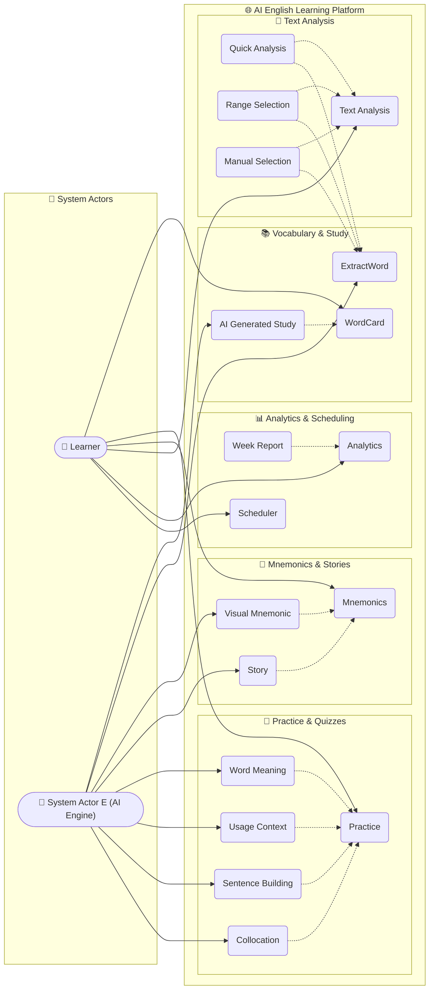
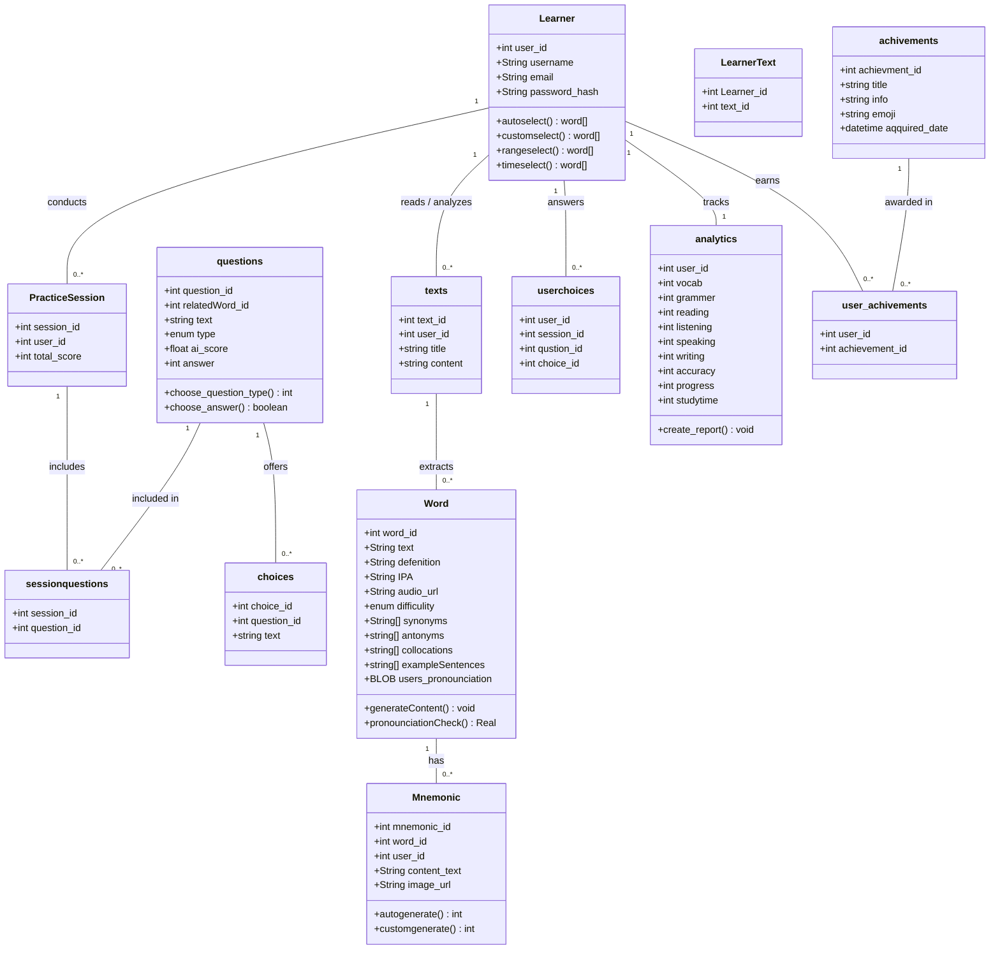

# AI-Powered English Learning & Pronunciation Evaluation Platform

> **Software Engineering Project (`Se_proj`)**  
> An intelligent web-based English learning platform that leverages AI to recommend contextual vocabulary, generate personalized study aids, and automatically evaluate learner pronunciation.

---

## 📌 Project Overview

This repository contains the software engineering architecture and UML domain models for an **AI-Powered English Learning Web Platform**. The platform is designed to personalize vocabulary acquisition and spoken English fluency by combining Natural Language Processing (NLP) with speech recognition and pronunciation assessment.

### Core Objectives
- 🤖 **AI-Driven Vocabulary Suggestion**: Automatically select and recommend words based on learner proficiency, reading materials, difficulty levels, and historical learning patterns (`autoselect`, `customselect`, `rangeselect`, `timeselect`).
- 🎙️ **Pronunciation Evaluation**: Capture user speech audio (`users_pronounciation`) and use AI speech analysis (`pronounciationCheck()`) to evaluate spoken accuracy against International Phonetic Alphabet (IPA) standards and reference audio.
- 🧠 **AI Mnemonics & Visual Narratives**: Automatically generate custom mnemonics, vivid imagery (`image_url`), and short memorable stories (`Visual Mnemonic`, `Story`) to reinforce vocabulary retention.
- 📖 **Text Analysis & Extraction**: Allow learners to import reading texts for quick analysis or manual range selection, where an AI backend (`System Actor E`) extracts key vocabulary (`ExtractWord`).
- 📝 **Dynamic Practice Sessions**: Generate adaptive quizzes and practice sessions covering word meaning, usage context, sentence building, and collocations.
- 📊 **Multidimensional Analytics**: Track learning progress across key competencies (Vocabulary, Grammar, Reading, Listening, Speaking, Writing), calculate accuracy and study time, and generate periodic performance reports.
- 🏆 **Gamification**: Reward user progress with achievement badges and milestones.

---

## 🛠️ Repository Structure

This repository contains **Sparx Systems Enterprise Architect** project files representing the system's software architecture, use cases, and database/class diagrams:

| File Name | Format | Description |
| :--- | :--- | :--- |
| `project.qea` | **Enterprise Architect 16+ (QEA / SQLite)** | Primary model database containing UML diagrams, use cases, actors, classes, attributes, operations, and connectors. |
| `project.eapx` | **Enterprise Architect (EAPX / Jet Engine)** | Legacy EAPX format file for compatibility with older Enterprise Architect versions. |
| `.eapx` | **Enterprise Architect Model Copy** | Additional model backup/workspace file. |
| `Enterprise Architect.lnk` | **Windows Shortcut** | Quick launch shortcut to open the project in Sparx Systems Enterprise Architect. |

---

## 📐 System Architecture & UML Models

The system architecture is modeled across two primary UML diagrams inside Enterprise Architect:
1. **Basic Use Case Model** (`Diagram_ID: 2`)
2. **Starter Class Diagram** (`Diagram_ID: 3`)

---

### 1. Use Case Model (`Basic Use Case Model`)

The use case model defines the interactions between the **Learner**, the automated **AI System (`System Actor E`)**, and the functional modules of the platform.



#### Key Actors
- **Learner (`Actor`)**: The end-user of the platform who studies vocabulary, analyzes texts, completes practice sessions, records pronunciation, and tracks progress.
- **System Actor E (`Actor`)**: The backend AI engine responsible for generating study cards (`AI GeneratedStudy`), extracting vocabulary (`ExtractWord`), creating mnemonics/stories (`Visual Mnemonic`, `Story`), generating practice items, and evaluating pronunciation.

#### Use Case Modules
- **WordCard & AI Generated Study**: Creates vocabulary flashcards with definitions, phonetic transcriptions (IPA), audio pronunciations, collocations, and example sentences.
- **Practice Module**: Adaptive exercises covering *Word Meaning*, *Usage Context*, *Sentence Building*, and *Collocation*.
- **Mnemonics Module**: AI-assisted creation of textual and *Visual Mnemonics* as well as contextual *Stories* to anchor vocabulary in memory.
- **Text Analysis Module**: Allows learners to submit reading texts for *Quick Analysis*, *Range Selection*, or *Manual Selection*, triggering automated vocabulary extraction (`ExtractWord`).
- **Analytics & Scheduler**: Provides structured study scheduling (`Scheduler`) and multi-skill analytics dashboards with weekly performance reports (`Week`).

---

### 2. Domain & Class Model (`Starter Class Diagram`)

The domain model defines the data entities, relationships, attributes, and operations that power the web application.



#### Detailed Class Descriptions

1. **`Word`**  
   The core vocabulary entity in the system.
   - **Key Attributes**:
     - `text`: The target vocabulary word.
     - `defenition`, `IPA`, `audio_url`, `difficulity` (Enum): Reference linguistic data.
     - `synonyms`, `antonyms`, `collocations`, `exampleSentences`: Lists of contextual usage data generated by AI.
     - `users_pronounciation` (`BLOB`): Stored user audio recording for pronunciation evaluation.
   - **Key Operations**:
     - `pronounciationCheck(): Real`: Compares user speech against native reference acoustics and IPA transcriptions, returning a pronunciation accuracy score.
     - `generateContent(): void`: Invokes AI services to generate definitions, collocations, and example sentences.

2. **`Learner`**  
   Represents the user account and user-driven word suggestion methods.
   - **Key Operations**:
     - `autoselect(): word[]`: AI-recommended word list based on proficiency and past progress.
     - `customselect(): word[]`: Manual vocabulary selection.
     - `rangeselect(): word[]`: Words extracted from a selected difficulty range or text passage.
     - `timeselect(): word[]`: Spaced-repetition words scheduled for review based on study timestamps.

3. **`Mnemonic`**  
   Memory aids associated with a `Word` and `Learner`.
   - **Key Attributes**: `content_text`, `image_url` (visual mnemonic illustration).
   - **Key Operations**: `autogenerate()`, `customgenerate()`.

4. **`PracticeSession`, `questions`, `choices`, `userchoices`, `sessionquestions`**  
   The assessment sub-schema. Handles interactive quizzes, AI question scoring (`ai_score`), multiple-choice options (`choices`), and user response logging (`userchoices`) within timed practice sessions.

5. **`texts` & `LearnerText`**  
   Reading texts submitted or selected by learners for natural language analysis and word extraction.

6. **`analytics`**  
   Comprehensive learner metrics across six linguistic skill dimensions:
   - `vocab`, `grammer`, `reading`, `listening`, `speaking`, `writing`
   - Overall `accuracy`, `progress`, and total `studytime`
   - **Key Operation**: `create_report(): void` (generates periodic/weekly summary reports).

7. **`achivements` & `user_achivements`**  
   Gamification system storing milestone badges (`title`, `info`, `emoji`, `aqquired_date`) linked to learners.

---

## 🔍 How to View and Inspect the Models

### 1. Opening in Enterprise Architect (Graphical UI)
1. Install [Sparx Systems Enterprise Architect](https://sparxsystems.com/products/ea/) (Version 16 or newer recommended for `.qea` SQLite support).
2. Double-click `Enterprise Architect.lnk` or open `project.qea` directly in Enterprise Architect.
3. In the **Project Browser**, expand:
   - `Model` ➔ `Use Cases` ➔ open **Basic Use Case Model** diagram.
   - `Model` ➔ `Starter Class Diagram` ➔ open **Starter Class Diagram**.

### 2. Inspecting the Database directly via SQLite / Python
Because `project.qea` is stored in the standard **QEA SQLite format**, you can query the architecture programmatically without proprietary tools:

```bash
# Example: Query all classes and notes using Python and SQLite
python3 -c "
import sqlite3
conn = sqlite3.connect('project.qea')
c = conn.cursor()
for row in c.execute(\"SELECT Name, Note FROM t_object WHERE Object_Type='Class'\"):
    print(f'Class: {row[0]}')
"
```

---

## 🚀 Recommended Technical Stack for Implementation

When implementing this software engineering architecture as a production web application, the following modern technology stack is recommended:

| Layer | Recommended Technologies | Purpose |
| :--- | :--- | :--- |
| **Frontend / Web UI** | **React / Next.js**, **TypeScript**, **Tailwind CSS** | Responsive web interface, interactive WordCards, practice sessions, and audio recording controls. |
| **Backend API** | **Node.js / Express**, **FastAPI (Python)** | REST / GraphQL API handling user authentication, session management, and orchestrating AI workflows. |
| **Database** | **PostgreSQL**, **Prisma ORM / SQLAlchemy** | Relational database mapping directly to the class schema (`Learner`, `Word`, `PracticeSession`, `analytics`, etc.). |
| **AI / NLP Engine** | **OpenAI API / LLMs**, **LangChain** | Vocabulary suggestion, definition generation, collocation/example sentence creation, and mnemonic/story generation. |
| **Speech & Pronunciation** | **OpenAI Whisper**, **Azure AI Speech (Pronunciation Assessment)** | Audio speech-to-text, IPA phoneme evaluation, and pronunciation accuracy scoring (`pronounciationCheck()`). |
| **Audio / Media Storage** | **AWS S3 / Cloudflare R2** | Cloud object storage for user pronunciation recordings (`users_pronounciation`) and mnemonic images (`image_url`). |

---

## 📄 License & Contributing
This repository is an academic/software engineering project (`Se_proj`). Pull requests and suggestions for extending the UML model or implementing backend services are welcome!
